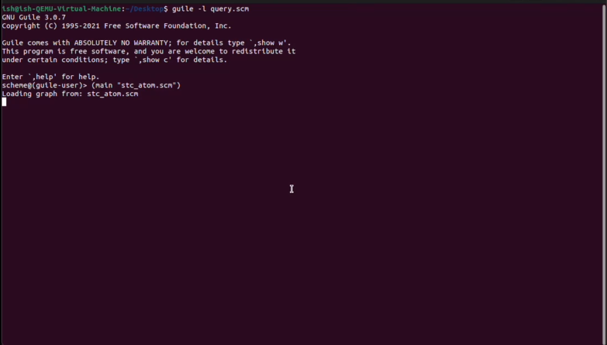
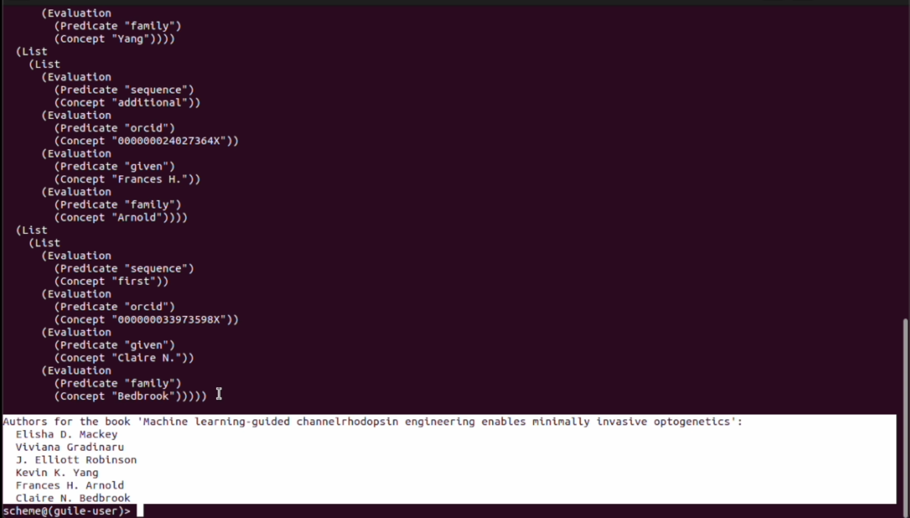

## Milestone 1 - Knowledge Graph Creation

### Description
This milestone focuses on developing a MeTTa-Driven Knowledge Graph incorporating STC data.

### Deliverables
- A functional bespoke knowledge graph system.

### Files and folders

- query.scm -- simple script to search atomspace graph for authors of a specified book title
- stc_to_atom.scm -- JSON ingestion script, takes a directory and recursively pulls all the json files from the dir and converts it into an atomspace "graph"
- stc_atom.scm.zip -- Atomspace "graph" of the ~21000 json files from stc
- stc_atom_first_100_rows.scm --  first 100 rows of stc_atom.scm

### Running the Application
Guile is a programming language and software framework that is part of the GNU project. It is an implementation of the Scheme programming language, a dialect of Lisp, and is designed to be embedded into applications to provide a scripting interface.
For Ubuntu systems, Guile can be installed from the default Ubuntu repositories.

To run the application, use the following commands:

1. 
```bash
guile -l query.scm
```

2. 
```bash
(main "stc_atom.scm")
```


### Screenshots
Here are some screenshots showcasing the functionalities:

**Graph upload**: 


**Graph query results**: 

