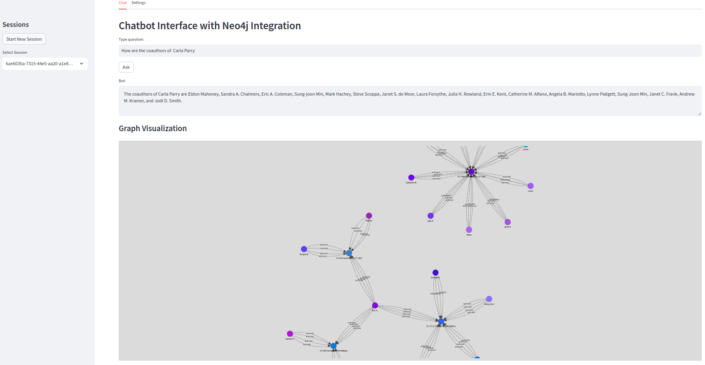

## Milestone 3 - Implementation for SNET Services

### Description
This milestone focuses on developing a web interface for service access and integrating Neo4j for intelligent data querying. The goal is to provide users with a seamless experience to interact with the data through a user-friendly web-based frontend.

### Deliverables
- A web-based frontend.
- A fully integrated Neo4j system.

### Progress Made

#### Data Folder
The data folder contains a small portion of the SNET graph. To run Neo4j on this data, use the following instructions:
1. Configure `.env` files similar to `.env.example`.

2. Run the container with Neo4j:
```bash
docker compose up
```

3. The `smallstc` graph will be built dynamically - just wait a couple of minutes. Afterwards, you'll be able to run the graph without delay.

#### Natural Language Query Capabilities
We demonstrated the potential of several LangChain's `GraphCypherQAChain` to allow users to ask the graph questions in natural language and visualize the result. This was achieved by implementing few-shot examples to train the system on how to interpret and convert natural language queries into Cypher statements for Neo4j. For visualization purposes, we've included an additional step where the user query is paraphrased. A separate tab is dedicated to store keys and configurations.


### Running the Application
To run the application, use the following commands:
1. Start the backend server:
```bash
uvicorn backend:app --reload
```
2. Start the frontend:
```bash
streamlit run frontend.py
```

### Screenshots
Here are some screenshots showcasing the web interface and its functionalities:

**Query Results**: 



### Conclusion
In this milestone, we have successfully developed a web-based frontend and integrated Neo4j for intelligent data querying. These advancements provide a seamless and intuitive interface for users to interact with the SNET graph, significantly enhancing the accessibility and usability of the data.