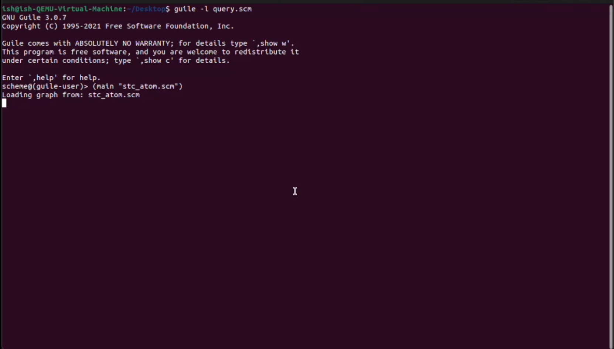
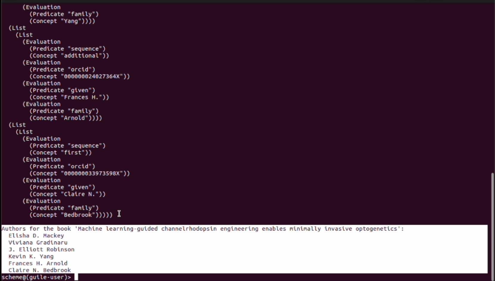

## Milestone 4 - Payment Integration

### Description
This milestone focuses on developing a web interface and an API/backend to showcase the usage of AGIX for payment purposes.

### Deliverables
- A web-based frontend.
- An API and backend to conduct payments in AGIX tokens (currently only Sepolia Testnet tokens)

### Files and folders

- api.py - fastapi
- backend.py - agix payemnt backend
- frontend.py - streamlit frontend
- users_db.json - temporary db

### Running the Application
To run the application, use the following commands:
1. Create a venv and install the python requirements
```
python3 -m venv venv
source venv/bin/activate
pip3 install -r requirements.txt
```
2. Add private keys in the .env file (example - .env.example)

3. Start the backend server:
```bash
uvicorn backend:app --reload
```
4. Start the frontend:
```bash
streamlit run frontend.py
```

### Screenshots
Here are some screenshots showcasing the web interface and its functionalities:

**Payment interface**: 


**Transaction details**: 

